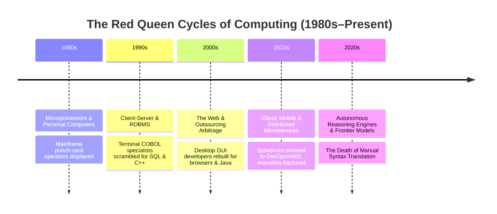

> *"Now, here, you see, it takes all the running you can do, to keep in the same place. If you want to get somewhere else, you must run at least twice as fast as that!"*  
> — Lewis Carroll, *Through the Looking-Glass*

There is a widespread, comforting myth circulating in engineering break rooms, campus hostels, and executive town halls across India today: that the current upheaval is merely a transient storm. The narrative suggests that once the "AI hype cycle" cools, or once companies realize generative models make mistakes, the industry will return to its comfortable, familiar rhythm: campus mass-hiring, predictable bell curves, offshore billing rates, and twenty-year linear ladders.

This book begins with an uncompromising truth:

**What you are experiencing today is not a freak storm. It is the core physics of technology asserting itself with renewed velocity.**

The sensation that the ground beneath your feet is liquefying is not unique to the generative AI era. It is the permanent condition of the computing discipline, and it has been absolute reality since at least the early 1980s—if not since the invention of the stored-program computer itself.

---

### The Red Queen Principle

In evolutionary biology, the **Red Queen Hypothesis** posits that an organism must constantly adapt, evolve, and proliferate simply to survive while pitted against ever-evolving competing organisms in an ever-shifting environment.

In the software industry, the Red Queen operates with ruthless efficiency:
- In the 1980s, the punch-card technician and mainframe batch operator watched personal microprocessors destroy their exclusivity.
- In the 1990s, programmers who believed knowing MS-DOS interrupts guaranteed lifelong employment were blindsided by Win32, SQL, and the commercial Internet.
- In the 2000s, engineers who built entire identities around writing SOAP XML endpoints watched REST, JSON, and dynamic scripting render their libraries obsolete.
- In the 2010s, system administrators who spent fifteen years mastering physical server racks were forced to learn Terraform, Kubernetes, and cloud virtualization—or face irrelevance.

At no point in the history of commercial software has knowledge of an artificial syntax or a specific framework granted a permanent annuity. What makes the current cycle feel so violent to the Indian software engineer is that for nearly twenty-five years (from 1998 to 2022), the rapid expansion of global IT outsourcing created a synthetic cushion—a protective bubble where tens of thousands could perform repetitive maintenance coding and be insulated from the Red Queen's fury.

That cushion has popped. The insulation is gone.

---

### The Fundamental Question: Do You Belong in This Industry?

Before learning new tools, before setting up autonomous agent harnesses, and before restructuring your career, there is a prior, much more urgent question you must answer with radical self-honesty:

**Do you actually belong in the technology industry?**

This is not an insult; it is a vital act of self-preservation.

In India, hundreds of thousands enter software engineering not out of affinity for systems, logic, or computing, but because of societal inertia. Technology was sold as the default middle-class civil service exam of the 21st century: *score well in entrance exams, secure a four-year engineering degree, get recruited on campus by a Tier-1 IT major, and your family's financial trajectory is solved for the next thirty-five years.*

If you entered tech seeking a static annuity—a career where what you learned between age 18 and 22 would sustain you until retirement—you made a category error. 

```mermaid
graph TD
    A[Motivations for Tech Career] --> B[Static Annuity Seeking]
    A --> C[Metabolic Curiosity & Agency]

    B --> D[Pain, Anxiety & Perpetual Obsolescence]
    C --> E[Sovereign Operator: High-Acuity Arbitrage]

    style B fill:#331a1a,stroke:#ef4444
    style C fill:#0f291e,stroke:#10b981
```

If the requirement to continuously unlearn yesterday's tools and master tomorrow's primitives fills you with dread, fatigue, and resentment, staying in this field will be an ongoing psychological grinder. Acknowledging this early is not defeat; it is the first step toward genuine sovereignty.

---

### The Trap of Moral Appeals

When an industry undergoes a Red Queen acceleration, the most dangerous reaction is to seek solace in corporate morality.

We have seen this movie before in India:
- **The 2015 Precedent:** In late 2014 and early 2015, when TCS conducted its first major restructuring of mid-to-senior "bench" professionals who had grown too expensive for billing, employees were stunned. Believing the Tata ethos was an inviolable family covenant, workers took to the streets, launched unions (FITE, NDLF), waved protest banners at the gates of Chennai's Siruseri and Bengaluru's Whitefield, and filed petitions in labour courts.
- **The 2025–2026 Echo:** A decade later, faced with margin compression from autonomous software generation, IT majors deployed silent PIPs, mandatory 5-day return-to-office traps with two-week relocation notices, and indefinite delays of fresher onboarding. Once again, employees turned to labour ministries, filed complaints, and put up posters outside SEZ tech parks.

Both responses failed for the exact same reason: **They treated a mathematical margin reallocation as an ethical grievance.**

Capital has no memory. Algorithms have no empathy. A balance sheet cannot be shamed, unionized, or petitioned into continuing labor subsidies for work that a machine can execute at near-zero marginal cost. Appealing to the conscience of an enterprise at a tech park gate does not restore your leverage; it merely publishes your dependence to the world.

---

### The Promise of This Book

This book is not a guide on how to survive by begging the machine or the corporate hierarchy for mercy.

It is a manual for becoming a **Sovereign Technologist**.

It is written for the software professional in Bengaluru, Chennai, Hyderabad, Pune, Gurugram, or anywhere in Bharat who refuses to be collateral damage in the Great Inversion. It is for those who understand that while the Red Queen runs fast, those who master the underlying invariances—**the Stencil, the Brake Check, Fleet Orchestration, and the Sovereign Outcome Contract**—can turn this velocity into unprecedented personal agency and civilizational leverage.

The era of passive compliance is over. Let us begin.
