The Indian IT services industry—pioneered by giants like TCS, Infosys, Wipro, and Cognizant—was built upon an undeniable historical arbitrage: Indian labor cost a fraction of Western labor, while English proficiency and engineering credentials were abundant.

The commercial contract governing this empire was the **Time and Materials (T&M)** contract. Under T&M, the vendor was not rewarded for solving a problem rapidly; they were rewarded for deploying "billable heads." Efficiency was a disincentive. If an enterprise problem could be solved by two brilliant engineers in an afternoon, the firm made less revenue than if it deployed forty juniors for eighteen months.

```mermaid
graph TD
    subgraph Classical T&M Model
        A[Client Problem] --> B[40 Offshore Engineers]
        B --> C[Billable Hours]
        C --> D[Vendor Revenue Maximized]
    end
    
    subgraph The AI Sovereign Model
        E[Client Problem] --> F[1 Sovereign Architect]
        F --> G[Autonomous Agent Fleet]
        G --> H[Deterministic Outcome Delivered]
    end

    style B fill:#331a1a,stroke:#ef4444
    style G fill:#0f291e,stroke:#10b981
```

### The Inevitable Margin Compression

Generative AI destroys the T&M contract at both ends:

1. **Client Realization:** Western enterprise CTOs, under intense margin pressure, now use AI internally or demand that vendors pass AI productivity gains directly into lower billing rates.
2. **Autonomous Unit Economics:** A single sovereign engineer orchestrating subagents can now achieve the throughput that formerly required an entire offshore delivery floor.

The "bench" is no longer a strategic reserve of talent; it is an unsustainable balance-sheet liability. The 3-year campus hiring cycle and the massive corporate training campuses in Mysuru or Chennai cannot re-skill faster than models evolve.

### From Billable Head to Outcome Contract

The career ladder in traditional IT was designed around organizational sprawl: *Software Engineer &rarr; Senior Engineer &rarr; Team Lead &rarr; Project Manager &rarr; Delivery Manager &rarr; Vice President*. Power was measured by span of control: *How many heads sit under your cost center?*

In the AI era, span of human control is a liability. The sovereign metric is **Leverage**: *How much commercial outcome can you guarantee with zero human overhead?*

Engineers who remain in the body-shop mindset—waiting for a Jira ticket to tell them what to type, then logging 8 hours into a timesheet—will find themselves pushed to the periphery of economic relevance. Those who survive will learn to operate not as hands for hire, but as autonomous delivery engines.
