The greatest failure of modern senior developers entering the AI era is the **Laborer Trap**. 

They treat AI as a faster auto-complete. They sit with their IDE open, prompting line by line, wrestling with copilot suggestions, and getting drawn into microscopic debugging loops. In doing so, their own biological brain remains the active RAM of the project. They are tired, context-switched, and fundamentally constrained by the bandwidth of human typing.

The Sovereign Technologist makes an irreversible cognitive pivot: **The Shift from Laborer to Reviewing Authority.**

```mermaid
flowchart TD
    User["Sovereign Technologist (Reviewing Authority)"]
    Plane["Plane Workspaces (Outcome Contracts)"]
    Agents["Autonomous Fleet (Deck / Helm / Subagents)"]
    Auditor["Independent Auditor Agent (The Brake Check)"]
    Prod["Production Deployment & Value Delivery"]

    User -->|"Defines Outcome Spec & Constraints"| Plane
    Plane -->|"Dispatches Task Contract"| Agents
    Agents -->|"Builds Code & Tests"| Auditor
    Auditor -->|"Verifies Invariants & Gates"| User
    User -->|"30-Second Sign-off / Veto"| Prod

    style User fill:#1e3a8a,stroke:#3b82f6,stroke-width:2px;
    style Auditor fill:#831843,stroke:#ec4899;
    style Prod fill:#064e3b,stroke:#10b981;
```

### The 4 Elements of Fleet Orchestration

1. **The Outcome Contract:** Never prompt an agent with vague instructions like "fix this bug" or "build a login page." You must define an outcome contract specifying the exact inputs, outputs, invariants, and failure modes.
2. **Subagent Specialization:** Delegate tasks into bounded, concurrent subagents: one for deep codebase research, one for test drafting, one for execution, and one for independent auditing.
3. **The Auditor Brake Check:** An agent that writes code should never be the sole authority that verifies it. A separate Auditor Agent must run the test suite, verify security invariants, check type contracts, and confirm zero regression.
4. **The 30-Second Sign-Off:** The human operator retains supreme sovereignty. The human does not write boilerplate; the human reviews diffs, checks architectural intent, verifies moral and commercial alignment under *Aram (அறம்)*, and gives the decisive green light.

When this engine runs properly, a single sovereign technologist in Chennai, Pune, or Kochi wields the operational leverage of a 50-person engineering department.
